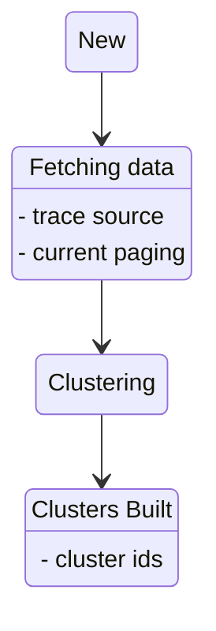

## Task lifecycle

```mermaid
stateDiagram-v2
    state "New" as New
	state "Fetching data" as Fetch:- trace source\n- current paging
	state "Clustering" as Cluster
	state "Clusters Built" as Done:- cluster ids
	
	New --> Fetch
	Fetch --> Cluster
	Cluster --> Done
```